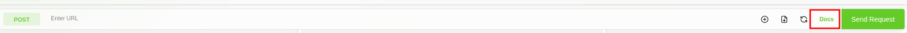
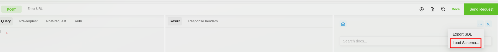
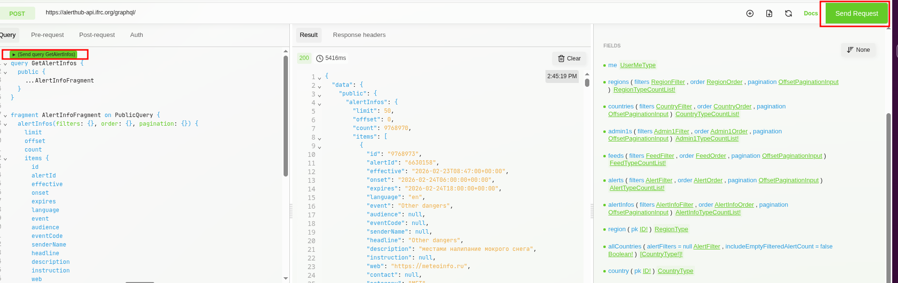
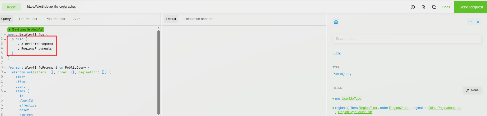
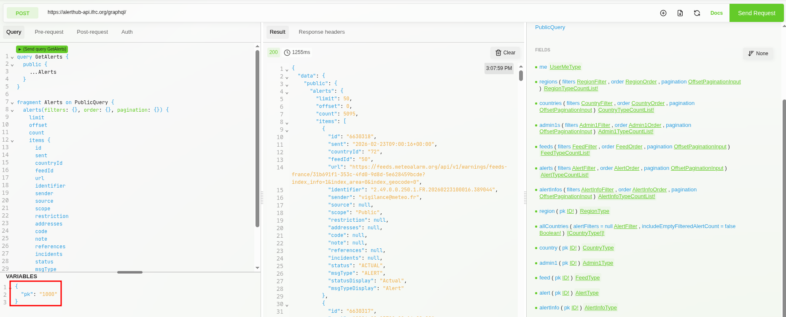

# Alert Hub GraphQL Client Usage Guide

## Introduction

### Client
Altair: https://altairgraphql.dev/

### Installation Guide

1. Add the [Altair](https://chrome.google.com/webstore/detail/altair-graphql-client/flnheeellpciglgpaodhkhmapeljopja) chrome extension.
2. Enable the extension and start it.
3. Once you are in the Altair client, install [altair-graphql-plugin-graphql-explorer](https://altairgraphql.dev/docs/plugins/popular-plugins#altair-graphql-plugin-graphql-explorer). For installation follow the following instructions.
    1. Go to the settings icon of Altair client.
    2. Click settings.
    3. Click `Toggle advanced mode`.
    4. Add the below block in already existing configuration file. 
    ```json
    "plugin.list": [
       "altair-graphql-plugin-graphql-explorer"
    ]
    ```
    The config should now look like
    ```json
    {
      "theme": "system",
      "language": "en-US",
      "addQueryDepthLimit": 3,
      "tabSize": 2,
      "plugin.list": [
          "altair-graphql-plugin-graphql-explorer"
      ]
    }
    ```
    5. Save the changes.
    6. Reload the window.

For more information regarding the plugins, you can visit [altair plugins](https://altairgraphql.dev/docs/plugins/).

## Project Configuration and Usage

### Add Schema
* Go to the [alert-hub-backend](https://github.com/IFRCGo/alert-hub-backend) repository and download the [schema.graphql](https://github.com/IFRCGo/alert-hub-backend/blob/develop/schema.graphql) file.
> [!NOTE]\
> The schema file might change in the future. Make sure to use the latest one.
* Click `Docs` in Altair graphql client.



* Click the options button ``...`` and click `Load Schema...`.



* Select and load the downloaded schema file.

### Add GraphQL URL
Enter one of the following URL to the `Enter URL` field.
Production URL: (https://alerthub-api.ifrc.org/graphql/)

### Running a query
* Click on the `Docs` button in the top-rigt corner to open the schema explorer.


* From the Docs panel, browse and select the query or fragment you want to run.

* Click on the fields to view their structure and available fields.

* Click on "Add Fragment" for each field to run its corresponding queries or fragments.
  - Replace the default `---` with a meaningful query name.
  - The query name should match what you are executing.
* If the query belongs to the public schema
  - Wrap your fragment or query inside `public`
  - Add the fragment name after it



* For running multiple queries at once.
    - Add multiple fragment names



> [!IMPORTANT]\
> For mandatory parameters which are marked as `*` in the parameter selection, we need to pass the respective values using variables section or directly in the query.
* Click on the green `Send Request` button on top right or the `(Send query MyQuery)` button directly above the query.
* The response will be displayed on the right panel.

### Running a query using variables
> [!NOTE]\
> Variables can only be used with the queries that accept arguments
* Select the query you want to run and also select the parameters. The required parameters are identified by `*` after the parameter name.
* Click on the `$` sign next to the parameter. This will extract the current value into GraphQL variable.
* Click on `VARIABLES` section below the query window.
* Add the required arguments and corresponding values `JSON` format.
  ```json
  {
    "pk": "1000"
  }
  ```
* Or, we could also pass the value to parameter in the query itself. 
* Run the query and the response will be displayed on the right panel.



Please follow this [official GraphQL documentation](https://graphql.org/learn/) for more information on how to use GraphQL.
